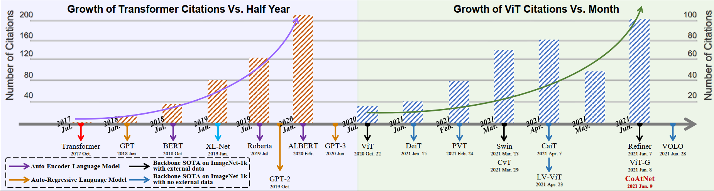

# <p align=center> [A Survey of Visual Transformers](https://ieeexplore.ieee.org/abstract/document/10088164)</p>

  
##### <p align=center> [Yang Liu](https://scholar.google.com/citations?user=ock4qjYAAAAJ&hl=zh-CN), [Yao Zhang](https://scholar.google.com/citations?user=vxfJSJIAAAAJ&hl=zh-CN), [Yixin Wang](https://scholar.google.com/citations?user=ykYrXtAAAAAJ&hl=zh-CN), [Feng Hou](https://scholar.google.com/citations?user=gp-OCDoAAAAJ&hl=zh-CN), [Jin Yuan](https://scholar.google.com/citations?hl=zh-CN&user=S1JGPCMAAAAJ), [Jiang Tian](https://scholar.google.com/citations?user=CC_HnVQAAAAJ&hl=zh-CN), [Yang Zhang](https://scholar.google.com/citations?user=fwg2QysAAAAJ&hl=zh-CN), [Zhongchao Shi](https://scholar.google.com/citations?hl=zh-CN&user=GASgQxEAAAAJ), [JianPing Fan](https://scholar.google.com/citations?user=-YsOqQcAAAAJ&hl=zh-CN), [Zhiqiang He](https://ieeexplore.ieee.org/author/37085386255)</p>




There is a comprehensive list of awesome visual Transformers literatures corresponding to the original order of our survey ([A Survey of Visual Transformers](https://ieeexplore.ieee.org/abstract/document/10088164)) published in IEEE Transactions on Neural Networks and Learning Systems (TNNLS). We will regularly update the latest representaive literatures and their released source code on this page. If you find some overlooked literatures, please make an issue or contact at liuyang20c@mails.ucas.ac.cn.

# Content
- [Original Transformer](#original-transformer)
- [Transformer for Classification](#transformer-for-classification)
- [Transformer for Detection](#transformer-for-detection)
- [Transformer for Segmentation](#transformer-for-segmentation)
- [Transformer for 3D Visual Recognition](#transformer-for-3d-visual-recognition)
- [Transformer for Multi-Sensory Data Stream](#transformer-for-multi-sensory-data-stream)
- [Other Awesome Transformer Attention Model Lists](#more-awesome-transformer-attention-model-lists)


# Original Transformer
**Attention Is All You Need.** [12th Jun. 2017] [NeurIPS, 2017].<br>
*Ashish Vaswani, Noam Shazeer, Niki Parmar, Jakob Uszkoreit, Llion Jones, Aidan N. Gomez, Lukasz Kaiser, Illia Polosukhin.*<br>
[[PDF](https://arxiv.org/abs/1706.03762)] [[Github](https://github.com/tensorflow/tensor2tensor)]

# Transformer for Classification

### 1. Original Visual Transformer

**Stand-Alone Self-Attention in Vision Models.** [13th Jun. 2019] [NeurIPS, 2019].<br>
*Prajit Ramachandran, Niki Parmar, Ashish Vaswani, Irwan Bello, Anselm Levskaya, Jonathon Shlens.*<br>
 [[PDF](https://arxiv.org/abs/1906.05909)] [[Github](https://github.com/google-research/google-research)]
 
**On the Relationship between Self-Attention and Convolutional Layers.** [10th Jan. 2020] [ICLR, 2020].<br>
*Jean-Baptiste Cordonnier, Andreas Loukas, Martin Jaggi.*<br>
 [[PDF](https://arxiv.org/abs/1911.03584)] [[Github](https://github.com/epfml/attention-cnn)]

**An Image is Worth 16x16 Words: Transformers for Image Recognition at Scale.** [10th Mar. 2021] [ICLR, 2021].<br>
*Alexey Dosovitskiy, Lucas Beyer, Alexander Kolesnikov, Dirk Weissenborn, Xiaohua Zhai, Thomas Unterthiner, Mostafa Dehghani, Matthias Minderer, Georg Heigold, Sylvain Gelly, Jakob Uszkoreit, Neil Houlsby.*<br>
 [[PDF](https://arxiv.org/abs/2010.11929)] [[Github](https://github.com/google-research/vision_transformer)]
 
### 2. Transformer Enhanced CNN
 
**Visual Transformers: Token-based Image Representation and Processing for Computer Vision.** [5th Jun 2020].<br>
*Bichen Wu, Chenfeng Xu, Xiaoliang Dai, Alvin Wan, Peizhao Zhang, Zhicheng Yan, Masayoshi Tomizuka, Joseph Gonzalez, Kurt Keutzer, Peter Vajda.*<br>
 [[PDF](https://arxiv.org/abs/2006.03677)] 
 
**Bottleneck Transformers for Visual Recognition.** [2nd Aug. 2021] [CVPR, 2021].<br>
*Aravind Srinivas, Tsung-Yi Lin, Niki Parmar, Jonathon Shlens, Pieter Abbeel, Ashish Vaswani.*<br>
 [[PDF](https://arxiv.org/abs/2101.11605)] [[Github](https://github.com/rwightman/pytorch-image-models)]
 
### 3. CNN Enhanced Transformer
 
**Training data-efficient image transformers & distillation through attention.** [15th Jan. 2021] [ICML, 2021].<br>
*Hugo Touvron, Matthieu Cord, Matthijs Douze, Francisco Massa, Alexandre Sablayrolles, Hervé Jégou.*<br>
 [[PDF](https://arxiv.org/abs/2012.12877)]  [[Github](https://github.com/facebookresearch/deit)]
 
**ConViT: Improving Vision Transformers with Soft Convolutional Inductive Biases** [10th Jun. 2021] [ICLR, 2021].<br>
*Christos Matsoukas, Johan Fredin Haslum, Magnus Söderberg, Kevin Smith.*<br>
 [[PDF](https://arxiv.org/abs/2103.10697)] [[Github](https://github.com/facebookresearch/convit)]
 
**Incorporating Convolution Designs into Visual Transformers** [20th Apr. 2021] [ICCV, 2021].<br>
*Kun Yuan, Shaopeng Guo, Ziwei Liu, Aojun Zhou, Fengwei Yu, Wei Wu.*<br>
 [[PDF](https://arxiv.org/abs/2103.11816)] [[Github](https://github.com/rishikksh20/CeiT-pytorch)]
 
**LocalViT: Bringing Locality to Vision Transformers.** [12nd Apr. 2021].<br>
*Yawei Li, Kai Zhang, JieZhang Cao, Radu Timofte, Luc van Gool.*<br>
 [[PDF](https://arxiv.org/abs/2104.05707)] [[Github](https://github.com/ofsoundof/LocalViT)]
 
**Conditional Positional Encodings for Vision Transformers.** [22nd Feb. 2021].<br>
*Xiangxiang Chu, Zhi Tian, Bo Zhang, Xinlong Wang, Xiaolin Wei, Huaxia Xia, Chunhua Shen.*<br>
 [[PDF](https://arxiv.org/abs/2102.10882)] [[Github](https://github.com/Meituan-AutoML/CPVT)]
 
**ResT: An Efficient Transformer for Visual Recognition.** [14th Oct. 2021] [NeurIPS, 2021].<br>
*Qinglong Zhang, YuBin Yang.*<br>
 [[PDF](https://arxiv.org/abs/2105.13677)] [[Github](https://github.com/wofmanaf/ResT)]
 
**Early Convolutions Help Transformers See Better.** [25th Oct. 2021] [NeurIPS, 2021 ].<br>
*Tete Xiao, Mannat Singh, Eric Mintun, Trevor Darrell, Piotr Dollár, Ross Girshick.*<br>
 [[PDF](https://arxiv.org/abs/2106.14881)] [[Github](https://github.com/Jack-Etheredge/early_convolutions_vit_pytorch)]
 
**CoAtNet: Marrying Convolution and Attention for All Data Sizes.** [15th Sep. 2021] [NeurIPS, 2021].<br>
*Zihang Dai, Hanxiao Liu, Quoc V. Le, Mingxing Tan.*<br>
 [[PDF](https://arxiv.org/abs/2106.04803)] [[Github](https://github.com/chinhsuanwu/coatnet-pytorch)]
 
### 4. Transfomrer with Local Attention
 
**Scaling Local Self-Attention for Parameter Efficient Visual Backbones.** [7th Jun. 2021] [CVPR, 2021].<br>
*Ashish Vaswani, Prajit Ramachandran, Aravind Srinivas, Niki Parmar, Blake Hechtman, Jonathon Shlens.*<br>
 [[PDF](https://arxiv.org/abs/2103.12731)] [[Github](https://github.com/rwightman/pytorch-image-models)]
 
**Swin Transformer: Hierarchical Vision Transformer using Shifted Windows.** [17th Aug. 2021] [ICCV, 2021].<br>
*Ze Liu, Yutong Lin, Yue Cao, Han Hu, Yixuan Wei, Zheng Zhang, Stephen Lin, Baining Guo.*<br>
 [[PDF](https://arxiv.org/abs/2103.14030)] [[Github](https://github.com/microsoft/Swin-Transformer)]

**VOLO: Vision Outlooker for Visual Recognition.** [24th Jun. 2021].<br>
*Li Yuan, Qibin Hou, Zihang Jiang, Jiashi Feng, Shuicheng Yan.*<br>
 [[PDF](https://arxiv.org/abs/2106.13112)] [[Github](https://github.com/sail-sg/volo)]
 
**Transformer in Transformer.** [26th Oct. 2021] [NeurIPS, 2021].<br>
*Kai Han, An Xiao, Enhua Wu, Jianyuan Guo, Chunjing Xu, Yunhe Wang.*<br>
 [[PDF](https://arxiv.org/abs/2103.00112)] [[Github](https://github.com/huawei-noah/CV-backbones)]
 
**Twins: Revisiting the Design of Spatial Attention in Vision Transformers.** [30th Sep. 2021] [NeurIPS, 2021].<br>
*Xiangxiang Chu, Zhi Tian, Yuqing Wang, Bo Zhang, Haibing Ren, Xiaolin Wei, Huaxia Xia, Chunhua Shen.*<br>
 [[PDF](https://arxiv.org/abs/2104.13840)] [[Github](https://github.com/Meituan-AutoML/Twins)]
 
 **Multi-Scale Vision Longformer: A New Vision Transformer for High-Resolution Image Encoding.** [27th May 2021] [ICCV, 2021].<br>
*Pengchuan Zhang, Xiyang Dai, Jianwei Yang, Bin Xiao, Lu Yuan, Lei Zhang, Jianfeng Gao.*<br>
 [[PDF](https://arxiv.org/abs/2103.15358)] [[Github](https://github.com/microsoft/vision-longformer)]
 
**Focal Self-attention for Local-Global Interactions in Vision Transformers.** [1st Jul. 2021].<br>
*Jianwei Yang, Chunyuan Li, Pengchuan Zhang, Xiyang Dai, Bin Xiao, Lu Yuan, Jianfeng Gao.*<br>
 [[PDF](https://arxiv.org/abs/2107.00641)] [[Github](https://github.com/microsoft/Focal-Transformer)]
 
### 5. Hierarchical Transformer
 
**Tokens-to-Token ViT: Training Vision Transformers from Scratch on ImageNet.** [30th Nov. 2021] [ICCV, 2021].<br>
*Li Yuan, Yunpeng Chen, Tao Wang, Weihao Yu, Yujun Shi, Zihang Jiang, Francis EH Tay, Jiashi Feng, Shuicheng Yan.*<br>
 [[PDF](https://arxiv.org/abs/2101.11986)] [[Github](https://github.com/yitu-opensource/T2T-ViT)]
 
**Pyramid Vision Transformer: A Versatile Backbone for Dense Prediction without Convolutions.** [11th Aug. 2021] [ICCV, 2021].<br>
*Wenhai Wang, Enze Xie, Xiang Li, Deng-Ping Fan, Kaitao Song, Ding Liang, Tong Lu, Ping Luo, Ling Shao.*<br>
 [[PDF](https://arxiv.org/abs/2102.12122)] [[Github](https://github.com/whai362/PVT)]
 
 **Pvtv2: Improved baselines with pyramid vision transformer.** [9th Feb. 2022].<br>
*Wenhai Wang, Enze Xie, Xiang Li, Deng-Ping Fan, Kaitao Song, Ding Liang, Tong Lu, Ping Luo, Ling Shao.*<br>
 [[PDF](https://arxiv.org/abs/2106.13797)] [[Github](https://github.com/whai362/PVT)]
 
**Rethinking Spatial Dimensions of Vision Transformers.** [18th Aug. 2021] [ICCV, 2021].<br>
*Byeongho Heo, Sangdoo Yun, Dongyoon Han, Sanghyuk Chun, Junsuk Choe, Seong Joon Oh.*<br>
 [[PDF](https://arxiv.org/abs/2103.16302)] [[Github](https://github.com/naver-ai/pit)]
 
 **CvT: Introducing Convolutions to Vision Transformers.** [29th Mar. 2021] [ICCV, 2021].<br>
*Haiping Wu, Bin Xiao, Noel Codella, Mengchen Liu, Xiyang Dai, Lu Yuan, Lei Zhang.*<br>
 [[PDF](https://arxiv.org/abs/2103.15808)] [[Github](https://github.com/microsoft/CvT)]
 
### 6. Deep Transfomrer
 
**Going deeper with Image Transformers.** [7th Apr. 2021] [ICCV, 2021].<br>
*Hugo Touvron, Matthieu Cord, Alexandre Sablayrolles, Gabriel Synnaeve, Hervé Jégou.*<br>
 [[PDF](https://arxiv.org/abs/2103.17239)] [[Github](https://github.com/facebookresearch/deit)]
 
**DeepViT: Towards Deeper Vision Transformer.** [19th Apr. 2021].<br>
*Daquan Zhou, Bingyi Kang, Xiaojie Jin, Linjie Yang, Xiaochen Lian, Zihang Jiang, Qibin Hou, Jiashi Feng.*<br>
 [[PDF](https://arxiv.org/abs/2103.11886)] [[Github](https://github.com/zhoudaquan/dvit_repo)]
 
**Refiner: Refining Self-attention for Vision Transformers.** [7th Jun. 2021].<br>
*Daquan Zhou, Yujun Shi, Bingyi Kang, Weihao Yu, Zihang Jiang, Yuan Li, Xiaojie Jin, Qibin Hou, Jiashi Feng.*<br>
 [[PDF](https://arxiv.org/abs/2106.03714)] [[Github](https://github.com/zhoudaquan/Refiner_ViT)]
 
**Vision Transformers with Patch Diversification.** [26th Apr. 2021].<br>
*Chengyue Gong, Dilin Wang, Meng Li, Vikas Chandra, Qiang Liu.*<br>
 [[PDF](https://arxiv.org/abs/2104.12753)] [[Github](https://github.com/ChengyueGongR/PatchVisionTransformer)]
 
### 7. Self-Supervised Transformer
 
**Generative Pretraining from Pixels.** [14th Nov. 2020] [ICML, 2020].<br>
*Mark Chen, Alec Radford, Rewon Child, Jeff Wu, Heewoo Jun, Prafulla Dhariwal, David Luan, Ilya Sutskever.*<br>
 [[PDF](https://cdn.openai.com/papers/Generative_Pretraining_from_Pixels_V2.pdf)] [[Github](https://github.com/openai/image-gpt)]
 
**MST: Masked Self-Supervised Transformer for Visual Representation.** [24th Oct. 2021] [NeurIPS, 2021].<br>
*Zhaowen Li, Zhiyang Chen, Fan Yang, Wei Li, Yousong Zhu, Chaoyang Zhao, Rui Deng, Liwei Wu, Rui Zhao, Ming Tang, Jinqiao Wang.*<br>
 [[PDF](https://arxiv.org/abs/2106.05656)]
 
**BEiT: BERT Pre-Training of Image Transformers.** [15th Jun. 2021] [ICLR, 2021].<br>
*Hangbo Bao, Li Dong, Furu Wei ·  Edit social preview.*<br>
 [[PDF](https://arxiv.org/abs/2106.08254)] [[Github](https://github.com/microsoft/unilm/tree/master/beit)]
 
**Masked Autoencoders Are Scalable Vision Learners.** [11th Nov. 2021].<br>
*Kaiming He, Xinlei Chen, Saining Xie, Yanghao Li, Piotr Dollár, Ross Girshick.*<br>
 [[PDF](https://arxiv.org/abs/2111.06377)] [[Github](https://github.com/facebookresearch/mae)]
 
**An Empirical Study of Training Self-Supervised Vision Transformers.** [16th Aug. 2021] [ICCV, 2021].<br>
*Xinlei Chen, Saining Xie, Kaiming He.*<br>
 [[PDF](https://arxiv.org/abs/2104.02057)] [[Github](https://github.com/facebookresearch/moco-v3)]
 
**Emerging Properties in Self-Supervised Vision Transformers.** [24th May. 2021] [ICCV, 2021].<br>
*Mathilde Caron, Hugo Touvron, Ishan Misra, Hervé Jégou, Julien Mairal, Piotr Bojanowski, Armand Joulin.*<br>
 [[PDF](https://arxiv.org/abs/2104.14294)] [[Github](https://github.com/facebookresearch/dino)]
 
**Self-Supervised Learning with Swin Transformers.** [10th May. 2021].<br>
*Zhenda Xie, Yutong Lin, Zhuliang Yao, Zheng Zhang, Qi Dai, Yue Cao, Han Hu.*<br>
 [[PDF](https://arxiv.org/abs/2105.04553)] [[Github](https://github.com/SwinTransformer/Transformer-SSL)]
 

# Transformer for Detection

### 1. Original Transformer Detector

**End-to-End Object Detection with Transformers.** [18th May. 2020] [ECCV, 2020].<br>
*Nicolas Carion, Francisco Massa, Gabriel Synnaeve, Nicolas Usunier, Alexander Kirillov, Sergey Zagoruyko.*<br>
 [[PDF](https://arxiv.org/abs/2005.12872)] [[Github](https://github.com/facebookresearch/detr)]
 
**Pix2seq: A Language Modeling Framework for Object Detection.** [27th Mar. 2022] [ICLR, 2022].<br>
*Ting Chen, Saurabh Saxena, Lala Li, David J. Fleet, Geoffrey Hinton.*<br>
 [[PDF](https://arxiv.org/abs/2109.10852)] [[Github](https://github.com/google-research/pix2seq)]
 
### 2. Sparse Attention
 
**Deformable DETR: Deformable Transformers for End-to-End Object Detection.** [18th Mar. 2021] [ICLR, 2021].<br>
*Xizhou Zhu, Weijie Su, Lewei Lu, Bin Li, Xiaogang Wang, Jifeng Dai.*<br>
 [[PDF](https://arxiv.org/abs/2010.04159)] [[Github](https://github.com/fundamentalvision/Deformable-DETR)]
 
**End-to-End Object Detection with Adaptive Clustering Transformer.** [18th Oct. 2021] [BMVC, 2021].<br>
*Minghang Zheng, Peng Gao, Renrui Zhang, Kunchang Li, Xiaogang Wang, Hongsheng Li, Hao Dong.*<br>
 [[PDF](https://arxiv.org/abs/2011.09315)] [[Github](https://github.com/gaopengcuhk/SMCA-DETR)]
 
**Pnp-detr: towards efficient visual analysis with transformers.** [2nd Mar. 2022] [ICCV, 2021].<br>
*Tao Wang, Li Yuan, Yunpeng Chen, Jiashi Feng, Shuicheng Yan.*<br>
 [[PDF](https://arxiv.org/abs/2109.07036)] [[Github](https://github.com/twangnh/pnp-detr)]
 
**Sparse DETR: Efficient End-to-End Object Detection with Learnable Sparsity.** [4th Mar. 2022] [ICLR, 2022].<br>
*Byungseok Roh, Jaewoong Shin, Wuhyun Shin, Saehoon Kim.*<br>
 [[PDF](https://arxiv.org/abs/2111.14330)] [[Github](https://github.com/kakaobrain/sparse-detr)]
 
### 3. Spatial Prior
 
**Fast Convergence of DETR with Spatially Modulated Co-Attention.** [19th Jan. 2021] [ICCV, 2021].<br>
*Peng Gao, Minghang Zheng, Xiaogang Wang, Jifeng Dai, Hongsheng Li.*<br>
 [[PDF](https://arxiv.org/abs/2101.07448)] [[Github](https://github.com/gaopengcuhk/SMCA-DETR)]
 
**Conditional DETR for Fast Training Convergence.** [19th Aug. 2021] [ICCV, 2021].<br>
*Depu Meng, Xiaokang Chen, Zejia Fan, Gang Zeng, Houqiang Li, Yuhui Yuan, Lei Sun, Jingdong Wang.*<br>
 [[PDF](https://arxiv.org/abs/2108.06152)] [[Github](https://github.com/atten4vis/conditionaldetr)]
 
**Anchor DETR: Query Design for Transformer-Based Object Detection.** [4th Jan. 2022] [AAAI 2021].<br>
*Yingming Wang, Xiangyu Zhang, Tong Yang, Jian Sun.*<br>
 [[PDF](https://arxiv.org/abs/2109.07107)] [[Github](https://github.com/megvii-research/AnchorDETR)]
 
**Efficient DETR: Improving End-to-End Object Detector with Dense Prior.** [3th Apr. 2021].<br>
*Zhuyu Yao, Jiangbo Ai, Boxun Li, Chi Zhang.*<br>
 [[PDF](https://arxiv.org/abs/2104.01318)]
 
**Dynamic detr: End-to-end object detection with dynamic attention.** [ICCV, 2021].<br>
*Xiyang Dai, Yinpeng Chen, Jianwei Yang, Pengchuan Zhang, Lu Yuan, Lei Zhang .*<br>
 [[PDF](https://openaccess.thecvf.com/content/ICCV2021/html/Dai_Dynamic_DETR_End-to-End_Object_Detection_With_Dynamic_Attention_ICCV_2021_paper.html)]
 
### 4. Structural Redesign
 
**Rethinking Transformer-based Set Prediction for Object Detection.** [12th Oct. 2021] [ICCV, 2021].<br>
*Zhiqing Sun, Shengcao Cao, Yiming Yang, Kris Kitani.*<br>
 [[PDF](https://arxiv.org/abs/2011.10881)] [[Github](https://github.com/edward-sun/tsp-detection)]
 
**You Only Look at One Sequence: Rethinking Transformer in Vision through Object Detection.** [27th Oct. 2021] [NeurIPS, 2021].<br>
*Yuxin Fang, Bencheng Liao, Xinggang Wang, Jiemin Fang, Jiyang Qi, Rui Wu, Jianwei Niu, Wenyu Liu.*<br>
 [[PDF](https://arxiv.org/abs/2106.00666)]  [[Github](https://github.com/hustvl/YOLOS)]

### 5. Pre-Trained Model 
 
**UP-DETR: Unsupervised Pre-training for Object Detection with Transformers.** [7th Apr. 2021] [CVPR, 2021].<br>
*Zhigang Dai, Bolun Cai, Yugeng Lin, Junying Chen.*<br>
 [[PDF](https://arxiv.org/abs/2011.09094)]  [[Github](https://github.com/dddzg/up-detr)]
 
**FP-DETR: Detection Transformer Advanced by Fully Pre-training.** [29th Sep. 2021] [ICLR, 2021].<br>
*Wen Wang, Yang Cao, Jing Zhang, DaCheng Tao.*<br>
 [[PDF](https://openreview.net/pdf?id=yjMQuLLcGWK)]  
 
### 6. Matcing Optimization
 
**DN-DETR: Accelerate DETR Training by Introducing Query DeNoising.** [2nd Mar. 2022] [CVPR, 2022].<br>
*Feng Li, Hao Zhang, Shilong Liu, Jian Guo, Lionel M. Ni, Lei Zhang.*<br>
 [[PDF](https://arxiv.org/abs/2203.01305)]  [[Github](https://github.com/IDEA-opensource/DN-DETR)]
 
**DINO: DETR with Improved DeNoising Anchor Boxes for End-to-End Object Detection.** [7th Mar. 2022].<br>
*Hao Zhang, Feng Li, Shilong Liu, Lei Zhang, Hang Su, Jun Zhu, Lionel M. Ni, Heung-Yeung Shum.*<br>
 [[PDF](https://arxiv.org/abs/2203.03605)]  [[Github](https://github.com/IDEACVR/DINO)]
 
### 7. Specialized Backbone for Dense Prediction
 
**Feature Pyramid Transformer.** [18th Jul. 2020] [ECCV, 2020].<br>
*Dong Zhang, Hanwang Zhang, Jinhui Tang, Meng Wang, Xiansheng Hua, Qianru Sun.*<br>
 [[PDF](https://arxiv.org/abs/2007.09451)]  [[Github](https://github.com/dongzhang89/FPT)]
 
**HRFormer: High-Resolution Vision Transformer for Dense Predict.** [7th Nov. 2021] [NeurIPS, 2021].<br>
*Yuhui Yuan, Rao Fu, Lang Huang, WeiHong Lin, Chao Zhang, Xilin Chen, Jingdong Wang.*<br>
 [[PDF](https://proceedings.neurips.cc//paper/2021/file/3bbfdde8842a5c44a0323518eec97cbe-Paper.pdf)]  [[Github](https://github.com/HRNet/HRFormer)]
 
**Multi-Scale High-Resolution Vision Transformer for Semantic Segmentation.** [23rd Nov. 2021].<br>
*Jiaqi Gu, Hyoukjun Kwon, Dilin Wang, Wei Ye, Meng Li, Yu-Hsin Chen, Liangzhen Lai, Vikas Chandra, David Z. Pan.*<br>
 [[PDF](https://arxiv.org/abs/2111.01236)]
 

 
# Transformer for Segmentation

### 1. Patch-Based Transformer

**Rethinking Semantic Segmentation from a Sequence-to-Sequence Perspective with Transformers.** [25th Jul. 2021] [CVPR 2021].<br>
*Sixiao Zheng, Jiachen Lu, Hengshuang Zhao, Xiatian Zhu, Zekun Luo, Yabiao Wang, Yanwei Fu, Jianfeng Feng, Tao Xiang, Philip H. S. Torr, Li Zhang.*<br>
 [[PDF](https://arxiv.org/abs/2012.15840)] [[Github](https://github.com/fudan-zvg/SETR)]
 
**TransUNet: Transformers Make Strong Encoders for Medical Image Segmentation.** [8th Feb. 2021].<br>
*Jieneng Chen, Yongyi Lu, Qihang Yu, Xiangde Luo, Ehsan Adeli, Yan Wang, Le Lu, Alan L. Yuille, Yuyin Zhou.*<br>
 [[PDF](https://arxiv.org/abs/2102.04306)] [[Github](https://github.com/Beckschen/TransUNet)]
 
**SegFormer: Simple and Efficient Design for Semantic Segmentation with Transformers.** [28th Oct. 2021] [NeurIPS 2021].<br>
*Enze Xie, Wenhai Wang, Zhiding Yu, Anima Anandkumar, Jose M. Alvarez, Ping Luo.*<br>
 [[PDF](https://arxiv.org/abs/2105.15203)] [[Github](https://github.com/NVlabs/SegFormer)]
 
### 2. Query-Based Transformer
 
**Attention-Based Transformers for Instance Segmentation of Cells in Microstructures.** [20th Nov. 2020] [IEEE BIBM 2020].<br>
*Tim Prangemeier, Christoph Reich, Heinz Koeppl.*<br>
 [[PDF](https://arxiv.org/abs/2011.09763)]
 
**End-to-End Video Instance Segmentation with Transformers.** [8th Oct. 2021] [CVPR 2021].<br>
*Yuqing Wang, Zhaoliang Xu, Xinlong Wang, Chunhua Shen, Baoshan Cheng, Hao Shen, Huaxia Xia.*<br>
 [[PDF](https://arxiv.org/abs/2011.14503)] [[Github](https://github.com/Epiphqny/VisTR)]
 
**Instances as Queries.** [23rd May 2021] [ICCV 2021].<br>
*Yuxin Fang, Shusheng Yang, Xinggang Wang, Yu Li, Chen Fang, Ying Shan, Bin Feng, Wenyu Liu.*<br>
 [[PDF](https://arxiv.org/abs/2105.01928)] [[Github](https://github.com/hustvl/QueryInst)]
 
**ISTR: End-to-End Instance Segmentation with Transformers.** [3rd May 2021].<br>
*Jie Hu, Liujuan Cao, Yao Lu, Shengchuan Zhang, Yan Wang, Ke Li, Feiyue Huang, Ling Shao, Rongrong Ji.*<br>
 [[PDF](https://arxiv.org/abs/2105.00637)] [[Github](https://github.com/hujiecpp/ISTR)]
 
**SOLQ: Segmenting Objects by Learning Queries.** [30th Sep 2021] [NeurIPS 2021].<br>
*Bin Dong, Fangao Zeng, Tiancai Wang, Xiangyu Zhang, Yichen Wei.*<br>
 [[PDF](https://arxiv.org/abs/2106.02351)] [[Github](https://github.com/megvii-research/SOLQ)]
 
**MaX-DeepLab: End-to-End Panoptic Segmentation with Mask Transformers.** [12th Jul. 2021] [CVPR 2021].<br>
*Huiyu Wang, Yukun Zhu, Hartwig Adam, Alan Yuille, Liang-Chieh Chen.*<br>
 [[PDF](https://arxiv.org/abs/2012.00759)] [[Github](https://github.com/google-research/deeplab2)]
 
**Segmenter: Transformer for Semantic Segmentation.** [2nd Sep. 2021] [ICCV 2021].<br>
*Robin Strudel, Ricardo Garcia, Ivan Laptev, Cordelia Schmid.*<br>
 [[PDF](https://arxiv.org/abs/2105.05633)] [[Github](https://github.com/rstrudel/segmenter)]
 
**Per-Pixel Classification is Not All You Need for Semantic Segmentation.** [31st Oct. 2021] [NeurIPS 2021].<br>
*Bowen Cheng, Alexander G. Schwing, Alexander Kirillov.*<br>
 [[PDF](https://arxiv.org/abs/2107.06278)] [[Github](https://github.com/facebookresearch/MaskFormer)]
 
# Transformer for 3D Visual Recognition

### 1. Representation Learning

**Point Transformer.** [16th Dec. 2020] [ICCV 2021].<br>
*Hengshuang Zhao, Li Jiang, Jiaya Jia, Philip Torr, Vladlen Koltun.*<br>
 [[PDF](https://arxiv.org/abs/2012.09164)] [[Github](https://github.com/lucidrains/point-transformer-pytorch)]
 
**PCT: Point cloud transformer.** [17th Dec. 2020] [CVM 2021].<br>
*Meng-Hao Guo, Jun-Xiong Cai, Zheng-Ning Liu, Tai-Jiang Mu, Ralph R. Martin, Shi-Min Hu.*<br>
 [[PDF](https://arxiv.org/abs/2012.09688)] [[Github](https://github.com/MenghaoGuo/PCT)]
 
**3DCTN: 3D Convolution-Transformer Network for Point Cloud Classification.** [2nd Mar. 2022].<br>
*Dening Lu, Qian Xie, Linlin Xu, Jonathan Li.*<br>
 [[PDF](https://arxiv.org/abs/2203.00828)]
 
**Fast Point Transformer.** [9th Dec. 2021] [CVPR 2022].<br>
*Chunghyun Park, Yoonwoo Jeong, Minsu Cho, Jaesik Park.*<br>
 [[PDF](https://arxiv.org/abs/2112.04702)]
 
**3D Object Detection with Pointformer.** [21th Dec. 2020] [CVPR 2021].<br>
*Xuran Pan, Zhuofan Xia, Shiji Song, Li Erran Li, Gao Huang.*<br>
 [[PDF](https://arxiv.org/abs/2012.11409)] [[Github](https://github.com/Vladimir2506/Pointformer)]
 
**Embracing Single Stride 3D Object Detector with Sparse Transformer.** [13th Dec. 2021].<br>
*Lue Fan, Ziqi Pang, Tianyuan Zhang, Yu-Xiong Wang, Hang Zhao, Feng Wang, Naiyan Wang, Zhaoxiang Zhang.*<br>
 [[PDF](https://arxiv.org/abs/2112.06375)] [[Github](https://github.com/tusimple/sst)]
 
**Voxel Transformer for 3D Object Detection.** [13th Sep. 2021] [ICCV 2021].<br>
*Jiageng Mao, Yujing Xue, Minzhe Niu, Haoyue Bai, Jiashi Feng, Xiaodan Liang, Hang Xu, Chunjing Xu.*<br>
 [[PDF](https://arxiv.org/abs/2109.02497)] [[Github](https://github.com/PointsCoder/VOTR)]
 
**Voxel Set Transformer: A Set-to-Set Approach to 3D Object Detection from Point Clouds.** [19th Mar. 2022].<br>
*Chenhang He, Ruihuang Li, Shuai Li, Lei Zhang.*<br>
 [[PDF](https://arxiv.org/abs/2203.10314)] [[Github](https://github.com/skyhehe123/voxset)]
 
**Point-BERT: Pre-training 3D Point Cloud Transformers with Masked Point Modeling.** [29th Nov. 2021] [CVPR 2022].<br>
*Xumin Yu, Lulu Tang, Yongming Rao, Tiejun Huang, Jie zhou, Jiwen Lu.*<br>
 [[PDF](https://arxiv.org/abs/2111.14819)] [[Github](https://github.com/lulutang0608/Point-BERT)]
 
**Masked Autoencoders for Point Cloud Self-supervised Learning.** [13th Mar. 2022] [CVPR 2022].<br>
*Xumin Yu, Lulu Tang, Yongming Rao, Tiejun Huang, Jie zhou, Jiwen Lu.*<br>
 [[PDF](https://arxiv.org/abs/2203.06604)] [[Github](https://github.com/Pang-Yatian/Point-MAE)]
 
**Masked Discrimination for Self-Supervised Learning on Point Clouds.** [21st Mar. 2022].<br>
*Haotian Liu, Mu Cai, Yong Jae Lee.*<br>
 [[PDF](https://arxiv.org/abs/2203.11183)] [[Github](https://github.com/haotian-liu/maskpoint)]

### 2. Cognition Mapping

**An End-to-End Transformer Model for 3D Object Detection.** [16th Sep. 2021] [ICCV 2021].<br>
*Ishan Misra, Rohit Girdhar, Armand Joulin.*<br>
 [[PDF](https://arxiv.org/abs/2109.08141)] [[Github](https://github.com/facebookresearch/3detr)]
 
**Group-Free 3D Object Detection via Transformers.** [23rd Apr. 2021] [ICCV 2021].<br>
*Ze Liu, Zheng Zhang, Yue Cao, Han Hu, Xin Tong.*<br>
 [[PDF](https://arxiv.org/abs/2104.00678)] [[Github](https://github.com/zeliu98/Group-Free-3D)]
 
**Improving 3D Object Detection with Channel-wise Transformer.** [23rd Aug. 2021] [ICCV 2021].<br>
*Hualian Sheng, Sijia Cai, YuAn Liu, Bing Deng, Jianqiang Huang, Xian-Sheng Hua, Min-Jian Zhao.*<br>
 [[PDF](https://arxiv.org/abs/2108.10723)] [[Github](https://github.com/hlsheng1/ct3d)]
 
**MonoDTR: Monocular 3D Object Detection with Depth-Aware Transformer.** [21st Mar. 2022] [CVPR 2022].<br>
*Kuan-Chih Huang, Tsung-Han Wu, Hung-Ting Su, Winston H. Hsu.*<br>
 [[PDF](https://arxiv.org/abs/2203.10981)] [[Github](https://github.com/kuanchihhuang/monodtr)]
 
**MonoDETR: Depth-aware Transformer for Monocular 3D Object Detection.** [28th Mar. 2022] [CVPR 2022].<br>
*Renrui Zhang, Han Qiu, Tai Wang, Xuanzhuo Xu, Ziyu Guo, Yu Qiao, Peng Gao, Hongsheng Li.*<br>
 [[PDF](https://arxiv.org/abs/2203.13310)] [[Github](https://github.com/zrrskywalker/monodetr)]
 
**DETR3D: 3D Object Detection from Multi-view Images via 3D-to-2D Queries.** [13th Oct. 2021] [CRL 2022].<br>
*Yue Wang, Vitor Guizilini, Tianyuan Zhang, Yilun Wang, Hang Zhao, Justin Solomon.*<br>
 [[PDF](https://arxiv.org/abs/2110.06922)] [[Github](https://github.com/wangyueft/detr3d)]
 
**TransFusion: Robust LiDAR-Camera Fusion for 3D Object Detection with Transformers.** [22nd Mar. 2022] [CVPR 2022].<br>
*Xuyang Bai, Zeyu Hu, Xinge Zhu, Qingqiu Huang, Yilun Chen, Hongbo Fu, Chiew-Lan Tai.*<br>
 [[PDF](https://arxiv.org/abs/2203.11496)] [[Github](https://github.com/xuyangbai/transfusion)]
 
### 3. Specific Processing
 
**PoinTr: Diverse Point Cloud Completion with Geometry-Aware Transformers.** [19th Aug. 2021] [ICCV 2021].<br>
*Xumin Yu, Yongming Rao, Ziyi Wang, Zuyan Liu, Jiwen Lu, Jie zhou.*<br>
 [[PDF](https://arxiv.org/abs/2108.08839)] [[Github](https://github.com/yuxumin/PoinTr)]
 
**SnowflakeNet: Point Cloud Completion by Snowflake Point Deconvolution with Skip-Transformer.** [27th Oct. 2021] [ICCV 2021].<br>
*Peng Xiang, Xin Wen, Yu-Shen Liu, Yan-Pei Cao, Pengfei Wan, Wen Zheng, Zhizhong Han.*<br>
 [[PDF](https://arxiv.org/abs/2108.04444)] [[Github](https://github.com/allenxiangx/snowflakenet)]
 
**Deep Point Cloud Reconstruction.** [23rd Nov. 2021] [ICLR 2022].<br>
*Jaesung Choe, Byeongin Joung, Francois Rameau, Jaesik Park, In So Kweon.*<br>
 [[PDF](https://arxiv.org/abs/2111.11704)] [[Github](https://github.com/allenxiangx/snowflakenet)]

# Transformer for Multi-Sensory Data Stream

### 1. Homologous Stream with Interactive Fusion

**MVT: Multi-view Vision Transformer for 3D Object Recognition.** [25th Oct. 2021] [BMVC 2021].<br>
*Shuo Chen, Tan Yu, Ping Li.*<br>
 [[PDF](https://arxiv.org/abs/2110.13083)] 
 
**Multiview Detection with Shadow Transformer (and View-Coherent Data Augmentation).** [12th Aug. 2021] [ACMM 2021].<br>
*Yunzhong Hou, Liang Zheng.*<br>
 [[PDF](https://arxiv.org/abs/2108.05888)] [[Github](https://github.com/hou-yz/mvdetr)]
 
**Multi-Modal Fusion Transformer for End-to-End Autonomous Driving.** [19th Apr. 2021] [CVPR 2021].<br>
*Aditya Prakash, Kashyap Chitta, Andreas Geiger.*<br>
 [[PDF](https://arxiv.org/abs/2104.09224)] [[Github](https://github.com/autonomousvision/transfuser)]
 
**COTR: Correspondence Transformer for Matching Across Images.** [15th Mar. 2021] [ICCV 2021].<br>
*Wei Jiang, Eduard Trulls, Jan Hosang, Andrea Tagliasacchi, Kwang Moo Yi.*<br>
 [[PDF](https://arxiv.org/abs/2103.14167)] [[Github](https://github.com/ubc-vision/COTR)]
 
**Multi-view 3D Reconstruction with Transformer.** [24th Mar. 2021] [ICCV 2021].<br>
*Dan Wang, Xinrui Cui, Xun Chen, Zhengxia Zou, Tianyang Shi, Septimiu Salcudean, Z. Jane Wang, Rabab Ward.*<br>
 [[PDF](https://openaccess.thecvf.com/content/ICCV2021/papers/Wang_Multi-View_3D_Reconstruction_With_Transformers_ICCV_2021_paper.pdf)] 
 
**TransformerFusion: Monocular RGB Scene Reconstruction using Transformers.** [15th Mar. 2021] [NeurIPS 2021].<br>
*Aljaž Božič, Pablo Palafox, Justus Thies, Angela Dai, Matthias Nießner.*<br>
 [[PDF](https://arxiv.org/abs/2107.02191)] 
 
**FUTR3D: A Unified Sensor Fusion Framework for 3D Detection.** [20th Mar. 2022]. <br>
*Xuanyao Chen, Tianyuan Zhang, Yue Wang, Yilun Wang, Hang Zhao.*<br>
 [[PDF](https://arxiv.org/abs/2203.10642)] 
 
### 2. Homologous Stream with Transfer Fusion
 
**Multi-view analysis of unregistered medical images using cross-view transformers.** [21th Mar. 2021] [MICCAI 2021].<br>
*Gijs van Tulder, Yao Tong, Elena Marchiori.*<br>
 [[PDF](https://arxiv.org/abs/2103.11390)] [[Github](https://github.com/gvtulder/cross-view-transformers)]
 
**Multi-view Depth Estimation using Epipolar Spatio-Temporal Networks.** [26th Nov. 2020] [CVPR 2021].<br>
*Xiaoxiao Long, Lingjie Liu, Wei Li, Christian Theobalt, Wenping Wang.*<br>
 [[PDF](https://arxiv.org/abs/2011.13118)] [[Github](https://github.com/xxlong0/ESTDepth)]
 
**Deep relation transformer for diagnosing glaucoma with optical coherence tomography and visual field function.** [26th Sep. 2021] [TMI 2021].<br>
*Diping Song, Bin Fu, Fei Li, Jian Xiong, Junjun He, Xiulan Zhang, Yu Qiao.*<br>
 [[PDF](https://ieeexplore.ieee.org/abstract/document/9422770)]
 
### 3. Heterologous Stream for Visual Grounding

**MDETR - Modulated Detection for End-to-End Multi-Modal Understanding.** [26th Apr. 2021] [ICCV 2021].<br>
*Aishwarya Kamath, Mannat Singh, Yann Lecun, Gabriel Synnaeve, Ishan Misra, Nicolas Carion.*<br>
 [[PDF](https://openaccess.thecvf.com/content/ICCV2021/papers/Kamath_MDETR_-_Modulated_Detection_for_End-to-End_Multi-Modal_Understanding_ICCV_2021_paper.pdf)] [[Github](https://github.com/ashkamath/mdetr)] 
 
**Referring Transformer: A One-step Approach to Multi-task Visual Grounding.** [6th Jun. 2021] [NeurIPS 2021].<br>
*Muchen Li, Leonid Sigal.*<br>
 [[PDF](https://arxiv.org/abs/2106.03089)]
 
**Visual Grounding with Transformer.** [10th May 2021] [ICME 2022].<br>
*Ye Du, Zehua Fu, Qingjie Liu, Yunhong Wang.*<br>
 [[PDF](https://arxiv.org/abs/2105.04281)] [[Github](https://github.com/usr922/VGTR)]
 
**TransVG: End-to-End Visual Grounding with Transformers.** [17th Apr. 2021] [ICCV 2021].<br>
*Jiajun Deng, Zhengyuan Yang, Tianlang Chen, Wengang Zhou, Houqiang Li.*<br>
 [[PDF](https://arxiv.org/abs/2104.08541)] [[Github](https://github.com/djiajunustc/TransVG)]
 
**Pseudo-Q: Generating Pseudo Language Queries for Visual Grounding.** [16th Mar. 2022] [CVPR 2022].<br>
*Haojun Jiang, Yuanze Lin, Dongchen Han, Shiji Song, Gao Huang.*<br>
 [[PDF](https://arxiv.org/abs/2203.08481)] [[Github](https://github.com/leaplabthu/pseudo-q)]
  
**LanguageRefer: Spatial-Language Model for 3D Visual Grounding.** [17th Jul. 2021] [ICoL 2021].<br>
*Junha Roh, Karthik Desingh, Ali Farhadi, Dieter Fox.*<br>
 [[PDF](https://arxiv.org/abs/2107.03438)]
 
**TransRefer3D: Entity-and-Relation Aware Transformer for Fine-Grained 3D Visual Grounding.** [5th Aug. 2021] [ACMM 2021].<br>
*Dailan He, Yusheng Zhao, Junyu Luo, Tianrui Hui, Shaofei Huang, Aixi Zhang, Si Liu.*<br>
 [[PDF](https://arxiv.org/abs/2108.02388)]
 
**Multi-View Transformer for 3D Visual Grounding.** [5th Apr. 2022] [CVPR 2022].<br>
*Shijia Huang, Yilun Chen, Jiaya Jia, LiWei Wang.*<br>
 [[PDF](https://arxiv.org/abs/2204.02174)] [[Github](https://github.com/sega-hsj/mvt-3dvg)]
 
**Human-centric Spatio-Temporal Video Grounding With Visual Transformers.** [10th Nov. 2020] [TCSVT 2021].<br>
*Zongheng Tang, Yue Liao, Si Liu, Guanbin Li, Xiaojie Jin, Hongxu Jiang, Qian Yu, Dong Xu.*<br>
 [[PDF](https://arxiv.org/abs/2204.02174)] [[Github](https://github.com/tzhhhh123/HC-STVG)]
 
**TubeDETR: Spatio-Temporal Video Grounding with Transformers.** [30th Mar. 2022] [CVPR 2022].<br>
*Antoine Yang, Antoine Miech, Josef Sivic, Ivan Laptev, Cordelia Schmid.*<br>
 [[PDF](https://arxiv.org/abs/2203.16434)] [[Github](https://github.com/antoyang/TubeDETR)]
 

 
### 4. Heterologous Stream with Visual-Linguistic Pre-Training:
**VideoBERT: A Joint Model for Video and Language Representation Learning.** [3rd Apr. 2019] [ICCV 2019].<br>
*Chen Sun, Austin Myers, Carl Vondrick, Kevin Murphy, Cordelia Schmid.*<br>
 [[PDF](https://arxiv.org/abs/1904.01766)] [[Github](https://github.com/ammesatyajit/VideoBERT)]
 
**ViLBERT: Pretraining Task-Agnostic Visiolinguistic Representations for Vision-and-Language Tasks.** [3th Aug. 2019] [NeurIPS 2019].<br>
*Jiasen Lu, Dhruv Batra, Devi Parikh, Stefan Lee.*<br>
 [[PDF](https://arxiv.org/abs/1908.02265)] [[Github](https://github.com/facebookresearch/vilbert-multi-task)]
 
**LXMERT: Learning Cross-Modality Encoder Representations from Transformers.** [20th Aug. 2019] [IJCNLP 2019].<br>
*Hao Tan, Mohit Bansal.*<br>
 [[PDF](https://arxiv.org/abs/1908.07490)] [[Github](https://github.com/airsplay/lxmert)]
 
**VisualBERT: A Simple and Performant Baseline for Vision and Language.** [20th Aug. 2019].<br>
*Liunian Harold Li, Mark Yatskar, Da Yin, Cho-Jui Hsieh, Kai-Wei Chang.*<br>
 [[PDF](https://arxiv.org/abs/1908.03557)] [[Github](https://github.com/uclanlp/visualbert)]
 
**VL-BERT: Pre-training of Generic Visual-Linguistic Representations.** [22nd Aug. 2019] [ICLR 2020].<br>
*Weijie Su, Xizhou Zhu, Yue Cao, Bin Li, Lewei Lu, Furu Wei, Jifeng Dai.*<br>
 [[PDF](https://arxiv.org/abs/1908.08530)] [[Github](https://github.com/jackroos/VL-BERT)]
 
**UNITER: UNiversal Image-TExt Representation Learning.** [24th Sep. 2019] [ECCV 2020].<br>
*Yen-Chun Chen, Linjie Li, Licheng Yu, Ahmed El Kholy, Faisal Ahmed, Zhe Gan, Yu Cheng, Jingjing Liu.*<br>
 [[PDF](https://arxiv.org/abs/1909.11740)] [[Github](https://github.com/ChenRocks/UNITER)]
 
**Oscar: Object-Semantics Aligned Pre-training for Vision-Language Tasks.** [13th Apr. 2019] [ECCV 2020].<br>
*Xiujun Li, Xi Yin, Chunyuan Li, Pengchuan Zhang, Xiao-Wei Hu, Lei Zhang, Lijuan Wang, Houdong Hu, Li Dong, Furu Wei, Yejin Choi, Jianfeng Gao.*<br>
 [[PDF](https://arxiv.org/abs/1909.11740)] [[Github](https://github.com/microsoft/Oscar)]
 
**Unified Vision-Language Pre-Training for Image Captioning and VQA.** [24th Sep. 2019] [AAAI 2020].<br>
*Luowei Zhou, Hamid Palangi, Lei Zhang, Houdong Hu, Jason J. Corso, Jianfeng Gao.*<br>
 [[PDF](https://arxiv.org/abs/1909.11059)] [[Github](https://github.com/LuoweiZhou/VLP)]
 
**ViLT: Vision-and-Language Transformer Without Convolution or Region Supervision.** [5th Feb. 2020] [ICML 2020].<br>
*Wonjae Kim, Bokyung Son, Ildoo Kim.*<br>
 [[PDF](https://arxiv.org/abs/2102.03334)] [[Github](https://github.com/dandelin/vilt)]
 
**VinVL: Revisiting Visual Representations in Vision-Language Models.** [2nd Jan. 2021] [CVPR 2021].<br>
*Pengchuan Zhang, Xiujun Li, Xiaowei Hu, Jianwei Yang, Lei Zhang, Lijuan Wang, Yejin Choi, Jianfeng Gao.*<br>
 [[PDF](https://arxiv.org/abs/2101.00529)] [[Github](https://github.com/pzzhang/VinVL)]
 
**Learning Transferable Visual Models From Natural Language Supervision.** [26th Feb. 2021] [ICML 2021].<br>
*Alec Radford, Jong Wook Kim, Chris Hallacy, Aditya Ramesh, Gabriel Goh, Sandhini Agarwal, Girish Sastry, Amanda Askell, Pamela Mishkin, Jack Clark, Gretchen Krueger, Ilya Sutskever.*<br>
 [[PDF](https://arxiv.org/abs/2103.00020)] [[Github](https://github.com/openai/CLIP)]
 
**Zero-Shot Text-to-Image Generation.** [24th Feb. 2021] [ICML 2021].<br>
*Aditya Ramesh, Mikhail Pavlov, Gabriel Goh, Scott Gray, Chelsea Voss, Alec Radford, Mark Chen, Ilya Sutskever.*<br>
 [[PDF](https://arxiv.org/abs/2102.12092)] [[Github](https://github.com/openai/DALL-E)]
 
**Scaling Up Visual and Vision-Language Representation Learning With Noisy Text Supervision.** [11th Feb. 2021] [ICML 2021].<br>
*Chao Jia, Yinfei Yang, Ye Xia, Yi-Ting Chen, Zarana Parekh, Hieu Pham, Quoc V. Le, YunHsuan Sung, Zhen Li, Tom Duerig.*<br>
 [[PDF](https://arxiv.org/abs/2102.05918)] [[Github](https://github.com/MicPie/clasp)]
 
**UniT: Multimodal Multitask Learning with a Unified Transformer.** [22nd Feb. 2021] [ICCV 2021].<br>
*Ronghang Hu, Amanpreet Singh.*<br>
 [[PDF](https://arxiv.org/abs/2102.10772)] [[Github](https://github.com/facebookresearch/mmf/tree/main/projects/unit)]
 
**SimVLM: Simple Visual Language Model Pretraining with Weak Supervision.** [24th Aug. 2021] [ICLR 2022].<br>
*ZiRui Wang, Jiahui Yu, Adams Wei Yu, Zihang Dai, Yulia Tsvetkov, Yuan Cao.*<br>
 [[PDF](https://arxiv.org/abs/2108.10904)] 
 
**data2vec: A General Framework for Self-supervised Learning in Speech, Vision and Language.** [7th Feb. 2022].<br>
*Alexei Baevski, Wei-Ning Hsu, Qiantong Xu, Arun Babu, Jiatao Gu, Michael Auli.*<br>
 [[PDF](https://arxiv.org/abs/2102.10772)] [[Github](https://github.com/pytorch/fairseq/tree/main/examples/data2vec)]

S. Nakamoto, “Bitcoin: A peer-to-peer electronic cash system,” 2008.

D. Tapscott and A. Tapscott, Blockchain revolution:how the technology behind bitcoin is changing money,business, and the world. Penguin, 2016.

M. Swan, Blockchain: Blueprint for a new economy. ”O’Reilly Media, Inc.”, 2015.

R. J. McWaters, R. Galaski, and S. Chatterjee, “The future of financial infrastructure: An ambitious look at how blockchain can reshape financial services,” 
in World Economic Forum, vol. 49, 2016, pp. 368–376.

N. Kshetri, “Can blockchain strengthen the internet of things?” IT professional, vol. 19, no. 4, pp. 68–72, 2017.

Z. Zheng, S. Xie, H. Dai, X. Chen, and H. Wang, “An overview of blockchain technology: Architecture, consensus, and future trends,” in 2017 IEEE international
congress on big data (BigData congress). Ieee, 2017,pp. 557–564.

P. Xu, J. Lee, J. R. Barth, and R. G. Richey, “Blockchain as supply chain technology: considering transparencyand security,” 
International Journal of Physical Distribution & Logistics Management, vol. 51, no. 3, pp. 305–324, 2021.

M. Mettler, “Blockchain technology in healthcare: The revolution starts here,” in 2016 IEEE 18th international conference on e-health networking, applications and
services (Healthcom). IEEE, 2016, pp. 1–3.

A. Ekblaw, A. Azaria, J. D. Halamka, and A. Lippman,“A case study for blockchain in healthcare:“medrec”prototype for electronic health records and medical
research data,” in Proceedings of IEEE open & big data conference, vol. 13. Vienna, Austria., 2016, p. 13.

Khezr, M. Moniruzzaman, A. Yassine, and R. Benlamri, “Blockchain technology in healthcare: A comprehensive review and directions for future research,”
Applied sciences, vol. 9, no. 9, p. 1736, 2019.

M. Fiore, A. Capodici, P. Rucci, A. Bianconi, G. Longo,M. Ricci, F. Sanmarchi, and D. Golinelli, “Blockchain for the healthcare supply chain: A systematic literature
review,” Applied Sciences, vol. 13, no. 2, p. 686, 2023.

M. Conoscenti, A. Vetro, and J. C. De Martin,“Blockchain for the internet of things: A systematic literature review,” in 2016 IEEE/ACS 13th Interna
tional Conference of Computer Systems and Applications (AICCSA). IEEE, 2016, pp. 1–6.

Y. Guo and C. Liang, “Blockchain application and outlook in the banking industry,” Financial innovation,vol. 2, pp. 1–12, 2016.

G. Wood et al., “Ethereum: A secure decentralised generalised transaction ledger,” Ethereum project yellow paper, vol. 151, no. 2014, pp. 1–32, 2014.

M. Conti, E. S. Kumar, C. Lal, and S. Ruj, “A survey on security and privacy issues of bitcoin,” IEEE communications surveys & tutorials, vol. 20, no. 4, pp.
3416–3452, 2018.JOURNAL OF LATEX CLASS FILES, VOL. 14, NO. 8, AUGUST 2015 31

Z. Zheng, S. Xie, H.-N. Dai, X. Chen, and H. Wang,“Blockchain challenges and opportunities: A survey,”International journal of web and grid services, vol. 14,
no. 4, pp. 352–375, 2018.

R. Zhang, R. Xue, and L. Liu, “Security and privacy on blockchain,” ACM Computing Surveys (CSUR), vol. 52,no. 3, pp. 1–34, 2019.

X. Li, P. Jiang, T. Chen, X. Luo, and Q. Wen, “A survey on the security of blockchain systems,” Future generation computer systems, vol. 107, pp. 841–853,2020.

A. Vaswani, N. Shazeer, N. Parmar, J. Uszkoreit,L. Jones, A. N. Gomez, Ł. Kaiser, and I. Polosukhin,“Attention is all you need,” Advances in neural 
information processing systems, vol. 30, 2017.

P. Xu, X. Zhu, and D. A. Clifton, “Multimodal learning with transformers: A survey,” IEEE Transactions on Pattern Analysis and Machine Intelligence, 2023.

A. Chernyavskiy, D. Ilvovsky, and P. Nakov, “Transformers:“the end of history” for natural language processing?” in Machine Learning and Knowledge 
Discovery in Databases. Research Track: European Conference, ECML PKDD 2021, Bilbao, Spain, September13–17, 2021, Proceedings, Part III 21. Springer, 2021,pp. 677–693.

H. Zhang and M. O. Shafiq, “Survey of transformers and towards ensemble learning using transformers for natural language processing,” Journal of big Data,vol. 11, no. 1, p. 25, 2024.

A. Dosovitskiy, L. Beyer, A. Kolesnikov, D. Weissenborn, X. Zhai, T. Unterthiner, M. Dehghani, M. Minderer, G. Heigold, S. Gelly et al., “An image is worth
16x16 words: Transformers for image recognition at scale,” arXiv preprint arXiv:2010.11929, 2020.

A. Gulati, J. Qin, C.-C. Chiu, N. Parmar, Y. Zhang,J. Yu, W. Han, S. Wang, Z. Zhang, Y. Wu et al., “Conformer: Convolution-augmented transformer for speech
recognition,” arXiv preprint arXiv:2005.08100, 2020.

J. Li, R. Selvaraju, A. Gotmare, S. Joty, C. Xiong, and S. C. H. Hoi, “Align before fuse: Vision and language representation learning with momentum distillation,”
Advances in neural information processing systems,vol. 34, pp. 9694–9705, 2021.

C. Ju, L. Gang, and D. Sun, “The application of blockchain in intelligent power data exchange,” Proceedings of the 2020 4th International Conference 
on Electronic Information Technology and Computer Engineering, 2020.

A. Dolgui, D. Ivanov, S. Potryasaev, B. Sokolov,M. Ivanova, and F. Werner, “Blockchain-oriented dynamic modelling of smart contract design and execution in the supply chain,” International Journal of Production Research, vol. 58, pp. 2184 – 2199, 2020.

T. Li, Y. Fang, Y. Lu, J. Yang, Z. Jian, Z. Wan, and Y. Li, “Smartvm: A smart contract virtual machine for fast on-chain dnn computations,” IEEE Transactions on
Parallel and Distributed Systems, vol. PP, pp. 1–1, 2022.

J. Weng, J. Weng, J. Zhang, M. Li, Y. Zhang, and W. Luo, “Deepchain: Auditable and privacy-preserving deep learning with blockchain-based incentive,” IEEE Transactions on Dependable and Secure Computing,
vol. 18, no. 5, pp. 2438–2455, 2019.

M. Shafay, R. W. Ahmad, K. Salah, I. Yaqoob, R. Jayaraman, and M. Omar, “Blockchain for deep learning: review and open challenges,” Cluster Computing,vol. 26, no. 1, pp. 197–221, 2023.

S. Naseer, Y. Saleem, S. Khalid, M. K. Bashir, J. Han,M. M. Iqbal, and K. Han, “Enhanced network anomaly detection based on deep neural networks,” IEEE access,vol. 6, pp. 48 231–48 246, 2018.

G. Sanjay Rai, S. Goyal, and P. Chatterjee, “Anomaly detection in blockchain using machine learning,” in Computational Intelligence for Engineering and Management Applications: Select Proceedings of CIEMA
2022. Springer, 2023, pp. 487–499.

L. Luu, D.-H. Chu, H. Olickel, P. Saxena, and A. Hobor,“Making smart contracts smarter,” in Proceedings of the 2016 ACM SIGSAC conference on computer and communications security, 2016, pp. 254–269.

N. Atzei, M. Bartoletti, and T. Cimoli, “A survey of attacks on ethereum smart contracts (sok),” in Principles of Security and Trust: 6th International Conference,POST 2017, Held as Part of the European Joint Conferences on Theory and Practice of Software, ETAPS 2017, Uppsala, Sweden, April 22-29, 2017, Proceedings 6. Springer, 2017, pp. 164–186.

S. Tikhomirov, E. Voskresenskaya, I. Ivanitskiy,R. Takhaviev, E. Marchenko, and Y. Alexandrov, “Smartcheck: Static analysis of ethereum smart contracts,” in Proceedings of the 1st 
international workshop on emerging trends in software engineering for blockchain, 2018, pp. 9–16.

U. Alon, M. Zilberstein, O. Levy, and E. Yahav,“code2vec: Learning distributed representations of code,” Proceedings of the ACM on Programming Languages, vol. 3, no. POPL, pp. 1–29, 2019.

W. U. Ahmad, S. Chakraborty, B. Ray, and K.-W.Chang, “Unified pre-training for program understanding and generation,” arXiv preprint arXiv:2103.06333,2021.

J. L. Elman, “Finding structure in time,” Cognitive science, vol. 14, no. 2, pp. 179–211, 1990.

D. Bahdanau, K. Cho, and Y. Bengio, “Neural machine translation by jointly learning to align and translate,”2016.

J. Devlin, M.-W. Chang, K. Lee, and K. Toutanova,“Bert: Pre-training of deep bidirectional transformers for language understanding,” 2019.

A. Radford, K. Narasimhan, T. Salimans, I. Sutskever et al., “Improving language understanding by generative pretraining,” 2018.

Y. Liu, M. Ott, N. Goyal, J. Du, M. Joshi, D. Chen,O. Levy, M. Lewis, L. Zettlemoyer, and V. Stoyanov,“Roberta: A robustly optimized bert pretraining approach,” 2019.

C. Raffel, N. Shazeer, A. Roberts, K. Lee, S. Narang,JOURNAL OF LATEX CLASS FILES, VOL. 14, NO. 8, AUGUST 2015 32 M. Matena, Y. Zhou, W. Li, and P. J. Liu, “Exploring
the limits of transfer learning with a unified text-to-text transformer,” 2023.

A. M. Antonopoulos and D. A. Harding, Mastering bitcoin. ” O’Reilly Media, Inc.”, 2023.

K. Li, H. Li, H. Hou, K. Li, and Y. Chen, “Proof of vote: A high-performance consensus protocol based on vote mechanism consortium blockchain,” 2017 
IEEE 19th International Conference on High Performance Computing and Communications; IEEE 15th International Conference on Smart City; IEEE 3rd International Conference on Data Science and Systems
(HPCC/SmartCity/DSS), pp. 466–473, 2017.

E. Regnath and S. Steinhorst, “Leapchain: Efficient blockchain verification for embedded iot,” 2018 EEE/ACM International Conference on ComputerAided Design (ICCAD), pp. 1–8, 2018.

B. Nasrulin, M. Muzammal, and Q. Qu, “A robust spatio-temporal verification protocol for blockchain,”pp. 52–67, 2018.

H. Li, T. Wang, Z. Qiao, B. Yang, Y. Gong, J. Wang,and G. Qiu, “Blockchain-based searchable encryption with efficient result verification and fair payment,” J.Inf. Secur. Appl., vol. 58, p. 102791, 2021.

J. Jayabalan and J. N, “A study on distributed consensus protocols and algorithms: The backbone of blockchain networks,” 2021 International Conference on Computer
Communication and Informatics (ICCCI), pp. 1–10,2021.

L. W. Cong and Z. He, “Blockchain disruption and smart contracts,” The Review of Financial Studies,vol. 32, no. 5, pp. 1754–1797, 2019.

S. Kim and S. Ryu, “Analysis of blockchain smart contracts: Techniques and insights,” 2020 IEEE Secure Development (SecDev), pp. 65–73, 2020.

Y. Wang, X. Chen, Y. Huang, H.-N. Zhu, and J. Bian,“An empirical study on real bug fixes in smart contracts projects,” ArXiv, vol. abs/2210.11990, 2022.

A. Alikhani and H.-R. Hamidi, “Regulating smart contracts: An efficient integration approach,” Intell. Decis.Technol., vol. 15, pp. 397–404, 2021.

J. Charlier, R. State, and J. Hilger, “Modeling smart contracts activities: A tensor based approach,” ArXiv,vol. abs/1905.09868, 2017.

S. S. Kushwaha, S. Joshi, D. Singh, M. Kaur, and H.N. Lee, “Ethereum smart contract analysis tools: A systematic review,” IEEE Access, vol. PP, pp. 1–1, 2022.

X. cong Zhou, Y. Chen, H. Guo, X. Chen, and Y. Huang,“Security code recommendations for smart contract,”2023 IEEE International Conference on Software Analysis, Evolution and Reengineering (SANER), pp. 190–200, 2023.

G. Prause, “Smart contracts for smart supply chains,”IFAC-PapersOnLine, 2019.

A. Dolgui, D. Ivanov, S. Potryasaev, B. Sokolov,M. Ivanova, and F. Werner, “Blockchain-oriented dynamic modelling of smart contract design and execution in the supply chain,” International Journal of Production Research, vol. 58, pp. 2184 – 2199, 2020.

L. Trautmann and R. Lasch, “Smart contracts in the context of procure-to-pay,” Smart and Sustainable Supply Chain and Logistics – Trends, Challenges, Methods and Best Practices, 2020.

B. Aejas and A. Bouras, “Effective smart contracts for supply chain contracts,” Building Resilience at Universities: Role of Innovation and Entrepreneurship, 2021.

A. Dosovitskiy, L. Beyer, A. Kolesnikov, D. Weissenborn, X. Zhai, T. Unterthiner, M. Dehghani,M. Minderer, G. Heigold, S. Gelly, J. Uszkoreit, and N. Houlsby, “An image is worth 16x16 words: 
Transformers for image recognition at scale,” ArXiv, vol.abs/2010.11929, 2020.

S. Amin and G. Neumann, “T2ner: Transformers based transfer learning framework for named entity recognition,” pp. 212–220, 2021.

R. A. Gabriel, B. H. Park, S. Mehdipour, D. N. Bongbong, S. Simpson, and R. S. Waterman, “Leveraging a natural language processing model (transformers) on electronic medical record notes to classify persistent opioid use after surgery,” Anesthesia Analgesia, vol.137, pp. 714 – 716, 2023.

Y. Liang, K. Feng, and Z. Ren, “Human activity recognition based on transformer via smart-phone sensors,”2023 IEEE 3rd International Conference on Computer Communication and Artificial Intelligence (CCAI), pp.267–271, 2023.

C. Yu, W. Yang, F. Xie, and J. He, “Technology and security analysis of cryptocurrency based on blockchain,”Complex., vol. 2022, pp. 5 835 457:1–5 835 457:15,2022.

A. Ghosh, S. Gupta, A. Dua, and N. Kumar, “Security of cryptocurrencies in blockchain technology: State-of-art, challenges and future prospects,” J. Netw. Comput.Appl., vol. 163, p. 102635, 2020.

D. G. Baur, K. Hong, and A. D. Lee, “Bitcoin: Medium of exchange or speculative assets?” Journal of International Financial Markets, Institutions and Money,vol. 54, pp. 177–189, 2018.

S. Corbet, B. Lucey, A. Urquhart, and L. Yarovaya,“Cryptocurrencies as a financial asset: A systematic analysis,” International Review of Financial Analysis,vol. 62, pp. 182–199, 2019.

T. Sanju, H. Liyanage, K. Bandara, D. Kandakkulama, D. D. Silva, and J. Perera, “Stock-crypto-app –recommendation system for stock and cryptocurrency market using cutting edge machine learning technol-
ogy,” International Research Journal of Innovations in Engineering and Technology, 2023.

M. Signorini, M. Pontecorvi, W. Kanoun, and R. Di Pietro, “Bad: blockchain anomaly detection,”arXiv preprint arXiv:1807.03833, 2018.

M. J. Shayegan, H. R. Sabor, M. Uddin, and C.-L. Chen,“A collective anomaly detection technique to detect crypto wallet frauds on bitcoin network,” Symmetry,vol. 14, no. 2, p. 328, 2022.

Z. Ahmad, A. Shahid Khan, K. Nisar, I. Haider, R. HasJOURNAL OF LATEX CLASS FILES, VOL. 14, NO. 8, AUGUST 2015 33 san, M. R. Haque, S. Tarmizi, and J. J. Rodrigues,
“Anomaly detection using deep neural network for iot architecture,” Applied Sciences, vol. 11, no. 15, p. 7050,2021.

J. Kim, M. Nakashima, W. Fan, S. Wuthier, X. Zhou,I. Kim, and S.-Y. Chang, “Anomaly detection based on traffic monitoring for secure blockchain networking,” in 2021 IEEE International Conference on Blockchain and Cryptocurrency (ICBC). IEEE, 2021, pp. 1–9.

M. Signorini, M. Pontecorvi, W. Kanoun, and R. Di Pietro, “Advise: anomaly detection tool for blockchain systems,” in 2018 IEEE World Congress on Services (SERVICES). IEEE, 2018, pp. 65–66.

S. Sayadi, S. B. Rejeb, and Z. Choukair, “Anomaly detection model over blockchain electronic transactions,”in 2019 15th international wireless communications & mobile computing conference (IWCMC). IEEE, 2019,pp. 895–900.

S. S. Saravanan, T. Luo, and M. Van Ngo, “Tsi-gan: Unsupervised time series anomaly detection using convolutional cycle-consistent generative adversarial networks,”
in Pacific-Asia Conference on Knowledge Discovery and Data Mining. Springer, 2023, pp. 39–54.

S. Morishima, “Scalable anomaly detection in blockchain using graphics processing unit,” Computers & Electrical Engineering, vol. 92, p. 107087, 2021.

T. Id´e, “Collaborative anomaly detection on blockchain from noisy sensor data,” in 2018 IEEE International Conference on Data Mining Workshops (ICDMW).IEEE, 2018, pp. 120–127.

W. Liang, L. Xiao, K. Zhang, M. Tang, D. He, and K.-C. Li, “Data fusion approach for collaborative anomaly intrusion detection in blockchain-based systems,” IEEE
Internet of Things Journal, vol. 9, no. 16, pp. 14 741–14 751, 2021.

D. Ofori-Boateng, I. S. Dominguez, C. Akcora,M. Kantarcioglu, and Y. R. Gel, “Topological anomaly detection in dynamic multilayer blockchain networks,”in Machine Learning and Knowledge Discovery in
Databases. Research Track: European Conference,ECML PKDD 2021, Bilbao, Spain, September 13–17,2021, Proceedings, Part I 21. Springer, 2021, pp. 788–804.

T. Voronov, D. Raz, and O. Rottenstreich, “Scalable blockchain anomaly detection with sketches,” in 2021 IEEE International Conference on Blockchain(Blockchain). IEEE, 2021, pp. 1–10.

A. Song, E. Seo, and H. Kim, “Anomaly vae-transformer: A deep learning approach for anomaly detection in decentralized finance,” IEEE Access, 2023.

L. Liu, W.-T. Tsai, M. Z. A. Bhuiyan, H. Peng, and M. Liu, “Blockchain-enabled fraud discovery through abnormal smart contract detection on ethereum,” Future 
Generation Computer Systems, vol. 128, pp. 158–166,2022.

Z. Batool, K. Zhang, Z. Zhu, S. Aravamuthan, and U. Aivodji, “Block-fest: A blockchain-based federated anomaly detection framework with computation of- floading using transformers,” in 2022 IEEE 1st Global
Emerging Technology Blockchain Forum: Blockchain & Beyond (iGETblockchain). IEEE, 2022, pp. 1–6.

C. Xu, S. Zhang, L. Zhu, X. Shen, and X. Zhang,“Illegal accounts detection on ethereum using heterogeneous graph transformer networks,” in International Conference on Information and Communications Secu-
rity. Springer, 2023, pp. 665–680.

Y. Chen, H. Dai, X. Yu, W. Hu, Z. Xie, and C. Tan, “Improving ponzi scheme contract detection using multichannel textcnn and transformer,” Sensors, vol. 21,no. 19, p. 6417, 2021.

Q. Zhou, X. Dang, D. Huo, Q. Ruan, C. Li, Y. Wang,and Z. Xu, “Logblock: An anomaly detection method on permissioned blockchain based on log-block sequence,” in 2022 IEEE Smartworld, Ubiquitous
Intelligence & Computing, Scalable Computing & Communications, Digital Twin, Privacy Computing,Metaverse, Autonomous & Trusted Vehicles (SmartWorld/UIC/ScalCom/DigitalTwin/PriComp/Meta).
IEEE, 2022, pp. 1008–1015.

Z. Wang, A. Ni, Z. Tian, Z. Wang, and Y. Gong,“Research on blockchain abnormal transaction detection technology combining cnn and transformer structure,”
Computers and Electrical Engineering, vol. 116, p.109194, 2024.

D. He, R. Wu, X. Li, S. Chan, and M. Guizani, “Detection of vulnerabilities of blockchain smart contracts,”IEEE Internet of Things Journal, 2023.

H. Chu, P. Zhang, H. Dong, Y. Xiao, S. Ji, and W. Li, “A survey on smart contract vulnerabilities: Data sources,detection and repair,” Information and Software Technology, p. 107221, 2023.

F. Luo, R. Luo, T. Chen, A. Qiao, Z. He, S. Song,Y. Jiang, and S. Li, “Scvhunter: Smart contract vulnerability detection based on heterogeneous graph attention
network,” in Proceedings of the IEEE/ACM 46th International Conference on Software Engineering, 2024, pp.1–13.

S. Vani, M. Doshi, A. Nanavati, and A. Kundu, “Vulnerability analysis of smart contracts,” arXiv preprint arXiv:2212.07387, 2022.

Z. Yang, M. Dai, and J. Guo, “Formal modeling and verification of smart contracts with spin,” Electronics,vol. 11, no. 19, p. 3091, 2022.

X. Tang, K. Zhou, J. Cheng, H. Li, and Y. Yuan,“The vulnerabilities in smart contracts: A survey,” in Advances in Artificial Intelligence and Security: 7th International Conference, ICAIS 2021, Dublin, Ireland,July 19-23, 2021, Proceedings, Part III 7. Springer,2021, pp. 177–190.

X. Wang and F. Xu, “The value of smart contract in trade finance,” Manufacturing & Service Operations Management, vol. 25, no. 6, pp. 2056–2073, 2023.

Z. Liu, P. Qian, X. Wang, Y. Zhuang, L. Qiu, and X. Wang, “Combining graph neural networks with expert knowledge for smart contract vulnerability detection,” IEEE Transactions on Knowledge and Data
JOURNAL OF LATEX CLASS FILES, VOL. 14, NO. 8, AUGUST 2015 34 Engineering, vol. 35, no. 2, pp. 1296–1310, 2021.

D. Han, Q. Li, L. Zhang, and T. Xu, “A smart contract vulnerability detection model based on graph neural networks,” in 2022 4th International Conference on
Frontiers Technology of Information and Computer(ICFTIC). IEEE, 2022, pp. 834–837.

H. Yang, J. Zhang, X. Gu, and Z. Cui, “Smart contract vulnerability detection based on abstract syntax tree,” in 2022 8th International Symposium on System Security,Safety, and Reliability (ISSSR). IEEE, 2022, pp. 169–170.

L. Zhang, J. Wang, W. Wang, Z. Jin, Y. Su, and H. Chen,“Smart contract vulnerability detection combined with multi-objective detection,” Computer Networks, vol.217, p. 109289, 2022.

W. Deng, H. Wei, T. Huang, C. Cao, Y. Peng, and X. Hu, “Smart contract vulnerability detection based on deep learning and multimodal decision fusion,” Sensors,vol. 23, no. 16, p. 7246, 2023.

J. Sui, L. Chu, and H. Bao, “An opcode-based vulnerability detection of smart contracts,” Applied Sciences,vol. 13, no. 13, p. 7721, 2023.

Y. Cao, F. Jiang, J. Xiao, S. Chen, X. Shao, and C. Wu,“Sccheck: A novel graph-driven and attention-enabled smart contract vulnerability detection framework for web 3.0 ecosystem,” IEEE Transactions on Network Science and Engineering, 2023.

Z. Yang and W. Zhu, “Improvement and optimization of vulnerability detection methods for ethernet smart contracts,” IEEE Access, 2023.

X. Yan, S. Wang, and K. Gai, “A semantic analysis-based method for smart contract vulnerability,” in 2022 IEEE 8th Intl Conference on Big Data Security on Cloud (BigDataSecurity), IEEE Intl Conference on
High Performance and Smart Computing,(HPSC) and IEEE Intl Conference on Intelligent Data and Security(IDS). IEEE, 2022, pp. 23–28.

H. Wu, H. Dong, Y. He, and Q. Duan, “Smart contract vulnerability detection based on hybrid attention mechanism model,” Applied Sciences, vol. 13, no. 2, p. 770,2023.

H. Wu, Z. Zhang, S. Wang, Y. Lei, B. Lin, Y. Qin,H. Zhang, and X. Mao, “Peculiar: Smart contract vulnerability detection based on crucial data flow graph and pre-training techniques,” in 2021 IEEE 32nd International Symposium on Software Reliability Engineering(ISSRE). IEEE, 2021, pp. 378–389.

S. Jeon, G. Lee, H. Kim, and S. S. Woo, “Smartcondetect: Highly accurate smart contract code vulnerability detection mechanism using bert,” in KDD Workshop on Programming Language Processing, 2021.

L. Zhang, J. Wang, W. Wang, Z. Jin, C. Zhao, Z. Cai,and H. Chen, “A novel smart contract vulnerability detection method based on information graph and ensemble learning,” Sensors, vol. 22, no. 9, p. 3581, 2022.

B. Mueller, “Mythril: security analysis tool for evmbytecode,” 2017.

P. Tsankov, A. Dan, D. Drachsler-Cohen, A. Gervais,F. Buenzli, and M. Vechev, “Securify: Practical security analysis of smart contracts,” in Proceedings of the 2018 ACM SIGSAC conference on computer and communications security, 2018, pp. 67–82.

G. Xu, L. Liu, and J. Dong, “Vulnerability detection of ethereum smart contract based on solbert-bigruattention hybrid neural model.” CMES-Computer Modeling in Engineering & Sciences, vol. 137, no. 1, 2023.

X. Tang, Y. Du, A. Lai, Z. Zhang, and L. Shi, “Deep learning-based solution for smart contract vulnerabilities detection,” Scientific Reports, vol. 13, no. 1, p.20106, 2023.

W. Jie, Q. Chen, J. Wang, A. S. V. Koe, J. Li, P. Huang,Y. Wu, and Y. Wang, “A novel extended multimodal ai framework towards vulnerability detection in smart contracts,” 
Information Sciences, vol. 636, p. 118907,2023.

B. Lˆe Hng, T. Lˆe c, T. o`an Minh, D. Trn Tun,D. Phan Th, and H. Phm V˘an, “Contextual language model and transfer learning for reentrancy vulnerability detection in smart contracts,” in Proceedings of the 12th International Symposium on Information and Communication Technology, 2023, pp. 739–745.

H. H. Nguyen, N.-M. Nguyen, C. Xie, Z. Ahmadi,D. Kudendo, T.-N. Doan, and L. Jiang, “Mando-hgt:Heterogeneous graph transformers for smart contract vulnerability detection,” in 2023 IEEE/ACM 20th International Conference on Mining Software Repositories(MSR). IEEE, 2023, pp. 334–346.

K. Gong, X. Song, N. Wang, C. Wang, and H. Zhu,“Scgformer: Smart contract vulnerability detection based on control flow graph and transformer,” IET Blockchain, vol. 3, no. 4, pp. 213–221, 2023.

J. Feist, G. Grieco, and A. Groce, “Slither: a static analysis framework for smart contracts,” in 2019 IEEE/ACM 2nd International Workshop on Emerging Trends in Software Engineering for Blockchain (WET-SEB). IEEE, 2019, pp. 8–15.

V. K. Jain and M. Tripathi, “An integrated deep learning model for ethereum smart contract vulnerability detection,” International Journal of Information Security,
vol. 23, no. 1, pp. 557–575, 2024.

E. Balcı, G. Yılmaz, A. Uzuno˘glu, and E. G. Soyak,“Accelerating smart contract vulnerability scan using transformers,” in 2023 IEEE Asia-Pacific Conference
on Computer Science and Data Engineering (CSDE).IEEE, 2023, pp. 1–6.

A. Tann, X. Han, S. Gupta, and Y. Ong, “Towards safer smart contracts: a sequence learning approach to detecting vulnerabilities (2018),” arXiv preprint arXiv:1811.06632, 1811.

F. Jiang, Y. Cao, J. Xiao, H. Yi, G. Lei, M. Liu, S. Deng,and H. Wang, “Vddl: A deep learning-based vulnerability detection model for smart contracts,” in International
Conference on Machine Learning for Cyber Security.Springer, 2022, pp. 72–86.

W. Hu, Z. Gu, Y. Xie, L. Wang, and K. Tang, “Chinese text classification based on neural networks and JOURNAL OF LATEX CLASS FILES, VOL. 14, NO. 8, AUGUST 2015 35 word2vec,” 2019 IEEE Fourth International Conference on Data Science in Cyberspace (DSC), pp. 284–291,2019.

P. Gong, W. Yang, L. Wang, F. Wei, K. HaiLaTi, and Y. Liao, “Gratdet: Smart contract vulnerability detector based on graph representation and transformer.” Computers, Materials & Continua, vol. 76, no. 2, 2023.

F. He, F. Li, and P. Liang, “Enhancing smart contract security: Leveraging pre-trained language models for advanced vulnerability detection,” IET Blockchain,2024.

S. Merity, N. S. Keskar, and R. Socher, “Regularizing and optimizing lstm language models,” arXiv preprint arXiv:1708.02182, 2017.

“Multilevel core-sets based aggregation clustering algorithm,” Journal of Software, vol. 24, no. 3,pp. 490–506, 2013.

J. Guo, L. Lu, and J. Li, “Smart contract vulnerability detection based on multi-scale encoders,” Electronics,vol. 13, no. 3, p. 489, 2024.

P. Qian, Z. Liu, Q. He, R. Zimmermann, and X. Wang,“Towards automated reentrancy detection for smart contracts based on sequential models,” IEEE Access, vol. 8,pp. 19 685–19 695, 2020.

X. Sun, L. Tu, J. Zhang, J. Cai, B. Li, and Y. Wang,“Assbert: Active and semi-supervised bert for smart contract vulnerability detection,” Journal of Information Security and Applications, vol. 73, p. 103423, 2023.

T. Gu, M. Han, S. He, and X. Chen, “Trap contract detection in blockchain with improved transformer,” in GLOBECOM 2023-2023 IEEE Global Communications Conference. IEEE, 2023, pp. 5141–5146.

H. Hu, Q. Bai, and Y. Xu, “Scsguard: Deep scam detection for ethereum smart contracts,” in IEEE INFOCOM 2022-IEEE Conference on Computer Communications Workshops (INFOCOM WKSHPS). IEEE, 2022, pp.1–6.

A. F. Bariviera, “The inefficiency of bitcoin revisited:A dynamic approach,” Economics Letters, vol. 161, pp.1–4, 2017.

J. Armour, D. Awrey, P. L. Davies, L. Enriques, J. N.Gordon, C. P. Mayer, and J. Payne, Principles of financial regulation. Oxford University Press, 2016.

C. Catalini and J. S. Gans, “Some simple economics of the blockchain,” Communications of the ACM, vol. 63,no. 7, pp. 80–90, 2020.

A. Pilipchenko, V. Kuzminsky, and O. Chumachenko,“Using methods of technical analysis to forecast the cryptocurrency market,” ”Scientific notes of the University”KROK”, 2021.

Y. Pronchakov and O. Bugaienko, “Methods of forecasting the prices of cryptocurrency on the financial markets,” Technology transfer: innovative solutions in Social Sciences and Humanities, pp. 13–16, 2019.

L. Yang, X.-Y. Liu, X. Li, and Y. Li, “Price prediction of cryptocurrency: an empirical study,” in Smart Blockchain: Second International Conference, SmartBlock 2019, Birmingham, UK, October 11–13, 2019,
Proceedings 2. Springer, 2019, pp. 130–139.

L. Catania, S. Grassi, and F. Ravazzolo, “Forecasting cryptocurrencies under model and parameter instability,” International Journal of Forecasting, vol. 35, no. 2,pp. 485–501, 2019.

S. Lahmiri and S. Bekiros, “Cryptocurrency forecasting with deep learning chaotic neural networks,” Chaos,Solitons & Fractals, vol. 118, pp. 35–40, 2019.

R. Mittal, S. Arora, and M. Bhatia, “Automated cryptocurrencies prices prediction using machine learning,”ICTACT Journal on Soft Computing, vol. 8, no. 04, p. 4,2018.

X. Sun, M. Liu, and Z. Sima, “A novel cryptocurrency price trend forecasting model based on lightgbm,” Finance Research Letters, vol. 32, p. 101084, 2020.

P. Jay, V. Kalariya, P. Parmar, S. Tanwar, N. Kumar, and M. Alazab, “Stochastic neural networks for cryptocurrency price prediction,” Ieee access, vol. 8, pp. 82 804–82 818, 2020.

F. M. S. Alamery, “Cryptocurrency analysis using machine learning and deep learning approaches,” Journal of Computer & Electrical and Electronics Engineering
Sciences, vol. 1, no. 2, pp. 29–33, 2023.

N. Abdul Rashid and M. T. Ismail, “Modelling and forecasting the trend in cryptocurrency prices,” Journal of Information and Communication Technology, vol. 22,no. 3, pp. 449–501, 2023.

M. M. Patel, S. Tanwar, R. Gupta, and N. Kumar,“A deep learning-based cryptocurrency price prediction scheme for financial institutions,” Journal of information security and applications, vol. 55, p. 102583, 2020.

D. M. Gunarto, S. Sa’adah, and D. Q. Utama, “Predicting cryptocurrency price using rnn and lstm method,”Jurnal Sisfokom (Sistem Informasi dan Komputer),vol. 12, no. 1, pp. 1–8, 2023.

G. Kim, D.-H. Shin, J. G. Choi, and S. Lim, “A deep learning-based cryptocurrency price prediction model that uses on-chain data,” IEEE Access, vol. 10, pp.56 232–56 248, 2022.

J. Kim, S. Kim, H. Wimmer, and H. Liu, “A cryptocurrency prediction model using lstm and gru algorithms,”in 2021 IEEE/ACIS 6th International Conference on 
Big Data, Cloud Computing, and Data Science (BCD).IEEE, 2021, pp. 37–44.

Y. Liu, G. Xiao, W. Chen, and Z. Zheng, “A lstm and gru-based hybrid model in the cryptocurrency price prediction,” in International Conference on Blockchain and Trustworthy Systems. Springer, 2023, pp. 32–43.

L. Steinert and C. Herff, “Predicting altcoin returns using social media,” PloS one, vol. 13, no. 12, p.e0208119, 2018.

A. Inamdar, A. Bhagtani, S. Bhatt, and P. M. Shetty,“Predicting cryptocurrency value using sentiment analysis,” in 2019 International conference on intelligent computing and control systems (ICCS). IEEE, 2019,pp. 932–934.

K. Wołk, “Advanced social media sentiment analysis for short-term cryptocurrency price prediction,” Expert JOURNAL OF LATEX CLASS FILES, VOL. 14, NO. 8, AUGUST 2015 36
Systems, vol. 37, no. 2, p. e12493, 2020.

S. Pathak and A. Kakkar, “Cryptocurrency price prediction based on historical data and social media sentiment analysis,” Innovations in Computer Science and Engineering: Proceedings of 7th ICICSE, pp. 47–55, 2020.

P. Prajapati, “Predictive analysis of bitcoin price considering social sentiments,” arXiv preprint arXiv:2001.10343, 2020.

S. Oikonomopoulos, K. Tzafilkou, D. Karapiperis, and V. Verykios, “Cryptocurrency price prediction using social media sentiment analysis,” in 2022 13th International Conference on Information, Intelligence, Systems & Applications (IISA). IEEE, 2022, pp. 1–8.

V. Koltun and I. P. Yamshchikov, “Pump it: Twitter sentiment analysis for cryptocurrency price prediction,”Risks, vol. 11, no. 9, p. 159, 2023.

S. Bhatt, M. Ghazanfar, and M. Amirhosseini,“Sentiment-driven cryptocurrency price prediction: A machine learning approach utilizing historical data and
social media sentiment analysis,” Machine Learning and Applications: An International Journal (MLAIJ),vol. 10, no. 2/3, pp. 1–15, 2023.

I. Chalkiadakis, A. Zaremba, G. W. Peters, and M. J.Chantler, “On-chain analytics for sentiment-driven statistical causality in cryptocurrencies,” Blockchain: Research and Applications, vol. 3, no. 2, p. 100063, 2022.

V. Derbentsev, N. Datsenko, V. Babenko, O. Pushko,and O. Pursky, “Forecasting cryptocurrency prices using ensembles-based machine learning approach,” in 2020 IEEE International Conference on Problems of Info communications. Science and Technology (PIC S&T).IEEE, 2020, pp. 707–712.

X. Du, Z. Tang, J. Wu, K. Chen, and Y. Cai, “A new hybrid cryptocurrency returns forecasting method based on multiscale decomposition and an optimized extreme learning machine using the sparrow search algorithm,”IEEE Access, vol. 10, pp. 60 397–60 411, 2022.

Z. Boukhers, A. Bouabdallah, M. Lohr, and J. J¨urjens, “Ensemble and multimodal approach for forecasting cryptocurrency price,” arXiv preprint arXiv:2202.08967, 2022.

V. Akila, M. Nitin, I. Prasanth, S. Reddy, and A. Kumar,“A cryptocurrency price prediction model using deep learning,” in E3S Web of Conferences, vol. 391. EDP Sciences, 2023, p. 01112.

H. Zhao, M. Crane, and M. Bezbradica, “Attention! transformer with sentiment on cryptocurrencies price prerediction,” 2022.

S. Penmetsa and M. Vemula, “Cryptocurrency price prediction with lstm and transformer models leveraging momentum and volatility technical indicators,” in 2023
IEEE 3rd International Conference on Data Science and Computer Application (ICDSCA). IEEE, 2023,pp. 411–416.

M. Davoudi, M. Ghavipour, M. Sargolzaei-Javan, and S. Dinparast, “Decentralized storage cryptocurrencies:An innovative network-based model for identifying effective entities and forecasting future price trends,”2023.

M. A. L. Khaniki and M. Manthouri, “Enhancing price prediction in cryptocurrency using transformer neural network and technical indicators,” arXiv preprint arXiv:2403.03606, 2024.

S. Sridhar and S. Sanagavarapu, “Multi-head selfattention transformer for dogecoin price prediction,” in 2021 14th International Conference on Human System Interaction (HSI). IEEE, 2021, pp. 1–6.

K. Murray, A. Rossi, D. Carraro, and A. Visentin, “On forecasting cryptocurrency prices: A comparison of machine learning, deep learning, and ensembles,”Forecasting, vol. 5, no. 1, pp. 196–209, 2023.

S. Singh and M. Bhat, “Transformer-based approach for ethereum price prediction using crosscurrency correlation and sentiment analysis,” arXiv preprint arXiv:2401.08077, 2024.

Y. Son, S. Vohra, R. Vakkalagadda, M. Zhu, A. Hirde,S. Kumar, and A. Rajaram, “Using transformers and deep learning with stance detection to forecast cryptocurrency price movement,” in 2022 13th International Conference on Information and Communication Technology Convergence (ICTC). IEEE, 2022, pp. 1–6.

K. Bhargavan, A. Delignat-Lavaud, C. Fournet, A. Gollamudi, G. Gonthier, N. Kobeissi, N. Kulatova, A. Rastogi, T. Sibut-Pinote, N. Swamy et al., “Formal verification of smart contracts: Short paper,” in Proceedings of the 2016 ACM workshop on programming languages and analysis for security, 2016, pp. 91–96.

K. Liu, D. Kim, T. F. Bissyand´e, S. Yoo, and Y. Le Traon, “Mining fix patterns for findbugs violations,” IEEE Transactions on Software Engineering,vol. 47, no. 1, pp. 165–188, 2018.

K. Delmolino, M. Arnett, A. Kosba, A. Miller, and E. Shi, “Step by step towards creating a safe smart contract: Lessons and insights from a cryptocurrency lab,” in Financial Cryptography and Data Security: FC 2016 International Workshops, BITCOIN, VOTING, and WAHC, Christ Church, Barbados, February 26, 2016,Revised Selected Papers 20. Springer, 2016, pp. 79–94.

I. Nikoli´c, A. Kolluri, I. Sergey, P. Saxena, and A. Hobor, “Finding the greedy, prodigal, and suicidal contracts at scale,” in Proceedings of the 34th annual computer security applications conference, 2018, pp.653–663.

N. Grech, M. Kong, A. Jurisevic, L. Brent, B. Scholz,and Y. Smaragdakis, “Madmax: Surviving out-of-gas conditions in ethereum smart contracts,” Proceedings of the ACM on Programming Languages, vol. 2, no.
OOPSLA, pp. 1–27, 2018.

M. Bartoletti and L. Pompianu, “An empirical analysis of smart contracts: platforms, applications, and design patterns,” in Financial Cryptography and Data Security:FC 2017 International Workshops, WAHC, BITCOIN,VOTING, WTSC, and TA, Sliema, Malta, April 7, 2017,Revised Selected Papers 21. Springer, 2017, pp. 494–509.

J. Yu, Q. Zhang, and L. Wang, “Design of optimal JOURNAL OF LATEX CLASS FILES, VOL. 14, NO. 8, AUGUST 2015 37 hybrid controller for multi-phase batch processes with interval time varying delay,” IEEE Access, vol. 7, pp.164 029–164 043, 2019.

A. Mendoza and G. Gu, “Mobile application web api reconnaissance: Web-to-mobile inconsistencies & vulnerabilities,” in 2018 IEEE Symposium on Security and Privacy (SP). IEEE, 2018, pp. 756–769.

L. Mou, G. Li, L. Zhang, T. Wang, and Z. Jin,“Convolutional neural networks over tree structures for programming language processing,” in Proceedings of the AAAI conference on artificial intelligence, vol. 30,no. 1, 2016.

J. Xu, K. Yin, and L. Liu, “State-continuity approximation of markov decision processes via finite element methods for autonomous system planning,” IEEE Robotics and Automation Letters, vol. 5, no. 4, pp.
5589–5596, 2020.

X. Hu, G. Li, X. Xia, D. Lo, S. Lu, and Z. Jin, “Summarizing source code with transferred api knowledge,”2018.

W. U. Ahmad, S. Chakraborty, B. Ray, and K.W. Chang, “A transformer-based approach for source code summarization,” arXiv preprint arXiv:2005.00653,2020.

B. Wei, G. Li, X. Xia, Z. Fu, and Z. Jin, “Code generation as a dual task of code summarization,” Advances in neural information processing systems, vol. 32, 2019.

S. Iyer, I. Konstas, A. Cheung, and L. Zettlemoyer,“Summarizing source code using a neural attention model,” in 54th Annual Meeting of the Association for Computational Linguistics 2016. Association for Computational Linguistics, 2016, pp. 2073–2083.

A. Eriguchi, K. Hashimoto, and Y. Tsuruoka, “Tree-to-sequence attentional neural machine translation,” arXiv preprint arXiv:1603.06075, 2016.

Y. Wan, Z. Zhao, M. Yang, G. Xu, H. Ying, J. Wu, and P. S. Yu, “Improving automatic source code summarization via deep reinforcement learning,” in Proceedings of the 33rd ACM/IEEE international conference on automated software engineering, 2018, pp. 397–407.

X. Hu, G. Li, X. Xia, D. Lo, and Z. Jin, “Deep code comment generation,” in Proceedings of the 26th conference on program comprehension, 2018, pp. 200–210.

Z. Gong, C. Gao, Y. Wang, W. Gu, Y. Peng, and Z. Xu,“Source code summarization with structural relative position guided transformer,” in 2022 IEEE International Conference on Software Analysis, Evolution and Reengineering (SANER). IEEE, 2022, pp. 13–24.

Z. Yang, J. Keung, X. Yu, X. Gu, Z. Wei, X. Ma, and M. Zhang, “A multi-modal transformer-based code summarization approach for smart contracts,” in 2021 IEEE/ACM 29th International Conference on Program
Comprehension (ICPC). IEEE, 2021, pp. 1–12.

Y. Gao and C. Lyu, “M2ts: Multi-scale multi-modal approach based on transformer for source code summarization,” in Proceedings of the 30th IEEE/ACM International Conference on Program Comprehension,
2022, pp. 24–35.

S. Gao, C. Gao, Y. He, J. Zeng, L. Y. Nie, and X. Xia,“Code structure guided transformer for source code summarization. corr abs/2104.09340 (2021),” arXiv preprint arXiv:2104.09340, 2021.

C. Shi, B. Cai, Y. Zhao, L. Gao, K. Sood, and Y. Xiang,“Coss: leveraging statement semantics for code summarization,” IEEE Transactions on Software Engineering,2023.

S. Gao, C. Gao, Y. He, J. Zeng, L. Nie, X. Xia, and M. Lyu, “Code structure–guided transformer for source code summarization,” ACM Transactions on Software Engineering and Methodology, vol. 32, no. 1, pp. 1–32, 2023.

V. J. Hellendoorn, C. Sutton, R. Singh, P. Maniatis, and D. Bieber, “Global relational models of source code,”in International conference on learning representations,2019.

Y. Choi, J. Bak, C. Na, and J.-H. Lee, “Learning sequential and structural information for source code summarization,” in Findings of the Association for Computational Linguistics: ACL-IJCNLP 2021, 2021,
pp. 2842–2851.

X. Hu, Z. Gao, X. Xia, D. Lo, and X. Yang, “Automating user notice generation for smart contract functions,” in 2021 36th IEEE/ACM International Conference on Automated Software Engineering (ASE). IEEE, 2021,pp. 5–17.

A. LeClair, S. Jiang, and C. McMillan, “A neural model for generating natural language summaries of program subroutines,” in 2019 IEEE/ACM 41st International Conference on Software Engineering (ICSE). IEEE,2019, pp. 795–806.

B. Wei, Y. Li, G. Li, X. Xia, and Z. Jin, “Retrieve and refine: exemplar-based neural comment generation,” in Proceedings of the 35th IEEE/ACM International Conference on Automated Software Engineering, 2020,pp. 349–360.

D. Khan, L. T. Jung, and M. Hashmani, “Systematic literature review of challenges in blockchain scalability,”Applied Sciences, 2021.

N. Rana, Y. K. Dwivedi, and D. L. Hughes, “Analysis of challenges for blockchain adoption within the indian public sector: an interpretive structural modelling approach,” Inf. Technol. People, vol. 35, pp. 548–576,2021.

A. Kneissler and S. Oelbracht, “Addressing the practical challenges of implementing blockchain in engineering and manufacturing,” AHFE International, 2023.

P. Golait, D. S. Tomar, R. Pateriya, and Y. K. Sharma,“Blockchain security and challenges: A review,” 2023 IEEE 2nd International Conference on Industrial Electronics: Developments Applications (ICIDeA), pp. 140–145, 2023.

J. B. Bernabe, J. L. C´anovas, J. L. Hern´andez-Ramos,R. T. Moreno, and A. Skarmeta, “Privacy-preserving solutions for blockchain: Review and challenges,” IEEE Access, vol. 7, pp. 164 908–164 940, 2019.
JOURNAL OF LATEX CLASS FILES, VOL. 14, NO. 8, AUGUST 2015 38

S. Wang, A. Pathania, and T. Mitra, “Neural network inference on mobile socs,” IEEE Design Test, vol. 37,no. 5, pp. 50–57, 2020.

C. Laroiya, D. Saxena, and C. Komalavalli, “Applications of blockchain technology,” Handbook of Research on Blockchain Technology, 2020.

S. Aggarwal, R. Chaudhary, G. Aujla, N. Kumar, K.K. R. Choo, and A. Y. Zomaya, “Blockchain for smart communities: Applications, challenges and opportunities,” J. Netw. Comput. Appl., vol. 144, pp. 13–48, 2019.

M. N. M. Bhutta, A. Khwaja, A. Nadeem, H. F. Ahmad,M. Khan, M. Hanif, H. Song, M. A. Alshamari, and Y. Cao, “A survey on blockchain technology: Evolution, architecture and security,” IEEE Access, vol. 9, pp.61 048–61 073, 2021.

J. Zhang, A. Ye, J. Chen, Y. Zhang, and W. Yang, “CSFL: Cooperative Security Aware Federated Learning Model Using The Blockchain,”The Computer Journal, vol. 67, no. 4,pp. 1298–1308, 06 2023. [Online]. Available:https://doi.org/10.1093/comjnl/bxad060

R. Chen, L. Wang, C. Peng, and R. Zhu, “An effective sharding consensus algorithm for blockchain systems,” Electronics, vol. 11, no. 16, 2022. [Online]. Available:https://www.mdpi.com/2079-9292/11/16/2597

# More Awesome Transformer Attention Model Lists
[cmhungsteve/Awesome-Transformer-Attention](https://github.com/cmhungsteve/Awesome-Transformer-Attention)

# Citation

If you find the listing and survey helpful, please cite it as follows:
```
@article{liu2023survey,
  title={A survey of visual transformers},
  author={Liu, Yang and Zhang, Yao and Wang, Yixin and Hou, Feng and Yuan, Jin and Tian, Jiang and Zhang, Yang and Shi, Zhongchao and Fan, Jianping and He, Zhiqiang},
  journal={IEEE Transactions on Neural Networks and Learning Systems},
  year={2023},
  publisher={IEEE}
}

```

